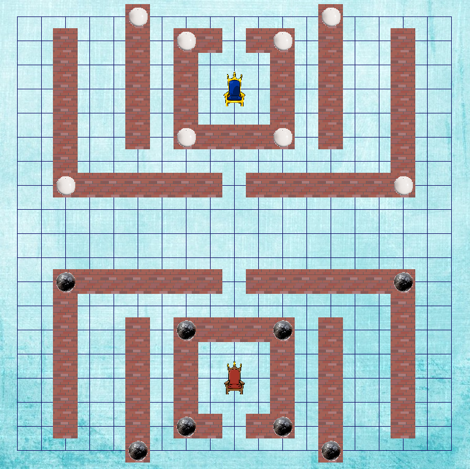

# Castle game

An implementation of an artificial inteligence algorithm min-max with alfa-beta pruning.  
Algorithm together with heuristic function extends game created by
<a href="https://github.com/wojciech1871/PADPy-PD1">wojciech1871</a> and <a href="https://github.com/MichalTurski">MichalTurski</a>.

### 1. Requirements

* Python 3.* (version 3.6.5 or higher recommended).
* Python packages: `pygame` nad `numpy`.

### 2. Game launching

* Download repository from Github, go to project's directory and type in terminal:  
`<python_interpreter> start.py`

* For each player provide a parameter that definces a depth of the search tree.
 Higher value results in a better artificial inteligence of computer players.
 Game enables to watch a match between two computer players with different search depth.
 Computer with higher depth search value wins.  
 It is recommended for parameters to be within range 1-4.

 * example:
 
      `Player1's deep: 2`  
      `Player2's deep: 4`  

### 3. Game rules

  

* **Walls and castle** - There are 3 type of cells: walls, thrones and normal (ground)
From the setup all stones are on wall cells.
* **Turn** - At each turn, each player moves a friendly stone
A stone may orthogonally slide any number of empty cells.
Sliding is only valid on the ground or on the wall. A slide cannot cross both types of cells.
A stone may move to a different type of cell (from a wall to the ground, or vice versa) if that cell is orthogonally adjacent.
It's possible to capture by replacement (capture is not mandatory).
* **Goal** - A player wins when he places one stone at the opponent throne.

### 4. Game options

* Turning sound on/off.
* Choosing game mode between 'Playes vs Computer' and 'Computer vs Computer'
* During game:  
    - press `ESC` button in order to back to menu.
