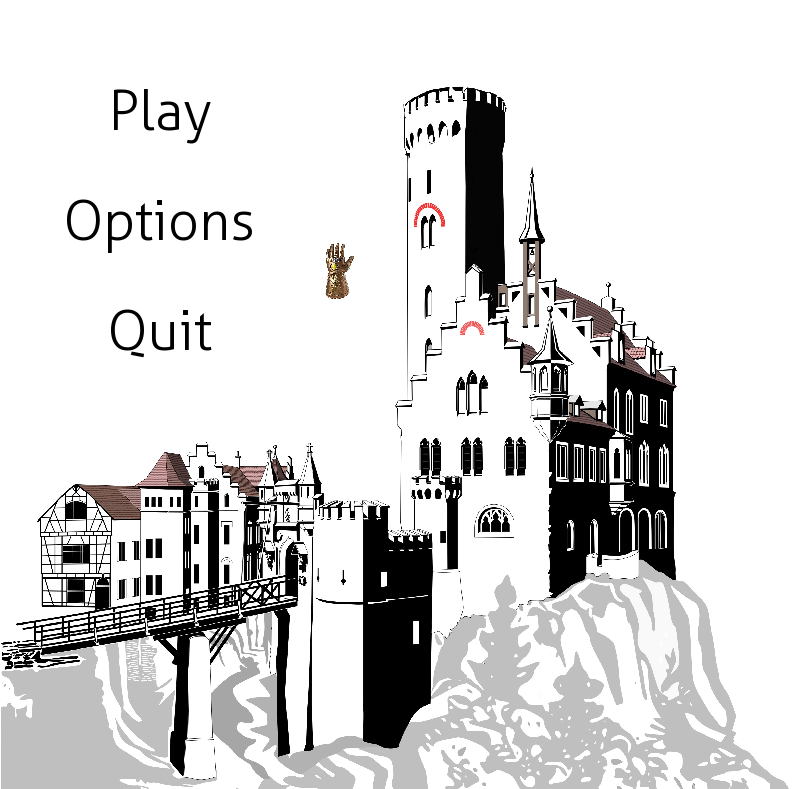

# Castle game

  

### 1. Requirements

* Python 3.* (version 3.6.5 or higher recommended).
* Python packages: `pygame` nad `numpy`.

### 2. Game launching

* Download repository from Github, go to project's directory and type in terminal:  
`<python_interpreter> start.py`

### 3. Game rules

  

* **Walls and castle** - There are 3 type of cells: walls, thrones and normal (ground)
From the setup all stones are on wall cells.
* **Turn** - At each turn, each player moves a friendly stone
A stone may orthogonally slide any number of empty cells.
Sliding is only valid on the ground or on the wall. A slide cannot cross both types of cells.
A stone may move to a different type of cell (from a wall to the ground, or vice versa) if that cell is orthogonally adjacent.
It's possible to capture by replacement (capture is not mandatory).
* **Goal** - A player wins when he places one stone at the opponent throne.

### 4. Game options

  

* Turning sound on/off.
* Choosing which balls move first.
* Game state saving/loading. Game's state is stored in `resources/saved.game` file 
* During game:
    - press `S` button in order to save game to file
    - press `L` button in order to load las saved game from file   
    - press `ESC` button in order to back to menu.
### 5. Game resources

All resources are stored in `resources` directory. Links to find them in the Internet below:
1. **Font**
* `Aller_Lt.ttf`: [link](https://www.fontsquirrel.com/fonts/list/popular)
2. **Images**
* `background.jpg`: [link](https://www.123rf.com/)
* `black-ball.jpg`: [link](https://intim8ecology.files.wordpress.com/2013/09/bideford-black-ball-p-ward-2013.jpg?w=590&h=606)
* `blue-throne.jpg`: [link](https://kathleenhalme.com/images/throne-clipart.png)
* `castle-icon.jpg`: [link](https://thenounproject.com/term/castle/198720/)
* `castle-menu.jpg`: [link](https://clipground.com/image-post/2513-ancestral-castle-clipart-11.jpg.html#overlayGallery_post_2513_ancestral-castle-clipart-11.jpg)
* `castle-options.jpg`: [link](https://library.kissclipart.com/20180911/aae/kissclipart-neuschwanstein-castle-clipart-neuschwanstein-castl-75a090d21c65ddec.jpg)
* `fire.jpg`: [link](https://techflourish.com/categories/free-house-fire-clipart.html#overlayGallery9_post_19423_flaming-maltese-cross-clipart-1.png)
* `gauntlet.jpg`: [link](https://c1-ebgames.eb-cdn.com.au/merchandising/images/packshots/482f916618a84c39a859929d14baa2d3_Large.png)
* `red-throne.jpg`: [link](https://kathleenhalme.com/images/throne-clipart-1.png)
* `wall.jpg`: [link](https://www.kisspng.com/png-stone-wall-brick-clip-art-brick-cliparts-186043/)
* `white-ball.jpp`: [link](http://www.jmc-billard.com/73-thickbox_default/bille-blanche-magnetique-aramith-o572mm.jpg)
3. **Sounds**
* `bomb.wav`: [link](http://soundbible.com/1234-Bomb.html)
* `click.wav`: [link](http://soundbible.com/783-Click.html)
* `stronghglod.mp3` [link](https://www.youtube.com/watch?v=Yvy2SQPZOPc)

(polish version below)

# Gra w zamki

### 1. Wymagania

* Python 3.* (zalecana wersja 3.6.5 lub wyższa).
* Moduły Pythona: `pygame` i `numpy`.

### 2. Uruchomienie gry

* Pobierz repozytorium projektu i będąc w głównym katalogu wpisz w terminalu:  
`<python_interpreter> start.py`

### 3. Game rules

* **Typy komórek** - Wyróżnia się 3 typy komórek: mury, 2 trony i zwykłe komórki (ziemia). 
Na początku wszystkie bile znajdują się na murach.
* **Tura** - W każdej turze gracz porusza prostopadle swoim pionkiem o dowolny dystans pustych komórek.
Przesuwanie pionka jest dozwolone jedynie po ziemi lub po murach.
Pionek może przmieścić się na inny typ komórki (z ziemi na mur lub vice versa) jeśli pola są prostopadle przystające.
Bicie następuje poprzez zastąpienie wrogiego pionka - nie jest obowiązkowe.
* **Cel** - Gracz wygrywa, jeśli umieści swój pionek na wrogim tronie.

### 4. Opcje gry

* Włączenie/wyciszenie dźwięku.
* Wybór rozpoczynającego koloru.
* Zapis/odczyt stanu gry. Plik zapisu to `resources/saved.game`.
* Podczas gry:
    - wciśnij `S` żeby zapisać
    - wciśnij `L` żeby odczytać  
    - wciśnij `ESC` żeby wyjść do menu.